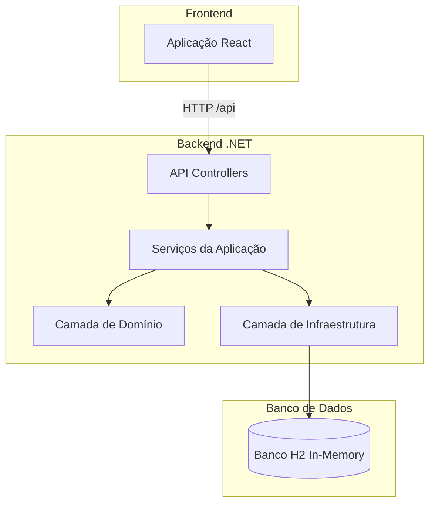
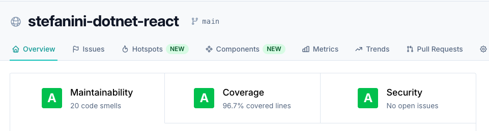

# 🚀 Desafio Stefanini .NET + React

<div align="center">

[](https://qlty.sh/gh/jailtoncruz/projects/stefanini-dotnet-react)
[](https://qlty.sh/gh/jailtoncruz/projects/stefanini-dotnet-react)

</div>

Este projeto é uma **aplicação web full-stack** desenvolvida com **.NET 9 (ASP.NET Core)** no backend e **React (Vite)** no frontend.  
A estrutura segue o formato de **monorepo**, utilizando **pnpm workspaces** e **Turborepo** para gerenciar o desenvolvimento, build e deploy.

---

## 🧩 Arquitetura

O backend segue o padrão **Clean Architecture**, separando responsabilidades em camadas distintas.  
O frontend é uma **single-page application (SPA)** desenvolvida com React e Vite, garantindo alta performance e recarregamento rápido.

### 🏗️ Estrutura da Solução

- **`StefaniniDotNetReactChallenge.API`** — Ponto de entrada do backend, uma ASP.NET Core Web API que expõe endpoints RESTful.
- **`StefaniniDotNetReactChallenge.Application`** — Contém a lógica de negócio, serviços e DTOs.
- **`StefaniniDotNetReactChallenge.Domain`** — Define entidades, regras de negócio e interfaces de repositório.
- **`StefaniniDotNetReactChallenge.Infrastructure`** — Implementa a persistência de dados com Entity Framework Core.
- **`StefaniniDotNetReactChallenge.Web`** — Aplicação frontend em React (SPA com Vite).
- **`StefaniniDotNetReactChallenge.Tests`** — Conjunto de testes automatizados para os componentes do backend.

---

### Diagrama da Arquitetura



## ✅ Atendendo aos Requisitos do Desafio Técnico

Este projeto foi desenvolvido para atender integralmente às especificações do desafio técnico.
Abaixo, segue um resumo de como cada requisito foi implementado.

---

### 🧩 1. Back-end (.NET 9 API REST)

A API foi desenvolvida em **ASP.NET Core 9**, seguindo o padrão **RESTful** e **Clean Architecture**.  
Ela oferece todas as operações CRUD para o gerenciamento de pessoas:

- **Cadastro (POST /api/v1/person)** – Criação de novos registros.
- **Alteração (PUT /api/v1/person/{id})** – Atualização de dados existentes.
- **Remoção (DELETE /api/v1/person/{id})** – Exclusão de registros.
- **Consulta (GET /api/v1/person)** – Listagem e busca de pessoas.
- **Consulta por Id (GET /api/v1/person/{id})** – Busca uma pessoa pelo Id.

**Validações implementadas:**

- **Nome**: obrigatório
- **Data de nascimento**: obrigatória, com validação de formato
- **CPF**: obrigatório, validado quanto ao formato e **unicidade**
- **E-mail**: opcional, validado quando informado
- **Naturalidade, Nacionalidade e Sexo**: opcionais
- **Datas de criação e atualização** armazenadas automaticamente

---

### 💻 2. Front-end (React + Vite)

O frontend foi desenvolvido em **React 18 + Vite**, com foco em uma **interface limpa, responsiva e intuitiva**.  
Permite executar todas as operações do CRUD:

- **Cadastro de pessoa**
- **Edição de informações existentes**
- **Remoção de registros**
- **Busca e listagem de pessoas**

A comunicação com o backend é feita via **fetch API** e controlada através de rotas RESTful.  
O frontend também possui tratamento de erros e feedbacks visuais claros para o usuário.

---

## ⚡ Extras Implementados

### 📘 Swagger (Documentação de Endpoints)

A API está documentada com **Swagger (Swashbuckle)**, permitindo explorar e testar endpoints diretamente pela interface.  
A documentação é acessível em `/api/swagger`.

---

### 🗄️ Banco de Dados H2

A aplicação utiliza o **banco de dados em memória H2**, conforme solicitado.  
Essa abordagem facilita a execução local e os testes automatizados sem necessidade de configuração externa.

---

### 🔢 Versionamento da API

Foram implementadas duas versões de API:

- **v1**: CRUD completo de pessoas (sem endereço de email obrigatório).
- **v2**: Inclui o campo **Email** como obrigatório, mantendo a v1 funcional.

Ambas estão acessíveis por rotas separadas:

- `/api/v1/person`
- `/api/v2/person`

---

### 🔐 Autenticação JWT

A autenticação foi implementada utilizando **JSON Web Token (JWT)**, permitindo que o frontend obtenha um token de acesso para realizar chamadas autenticadas à API.

Adicionei 3 nomes de usuários chaves para gerar o token, sendo **Jailton, Andressa e Stefanini**, o input é independentemente de letras maiúsculas ou minúsculas (case-insensitive).

**Exemplo de uso:**

```bash
POST /api/v1/auth/login
{
  "username": "stefanini"
}
```

```json
{
  "token": "<jwt_token>"
}
```

---

### 🧪 Testes Automatizados (xUnit)

Os testes automatizados foram implementados com **xUnit**, abrangendo:

- Camada de aplicação e domínio
- Validações de entidades
- Operações CRUD simuladas

A cobertura de testes supera **80%** e é reportada via **Qlty.sh**, com integração visual no README.

---

## ⚙️ Ambientes de Execução

### 🧑‍💻 Desenvolvimento

- O frontend (Vite) roda em **`http://localhost:5173`**.
- O backend (.NET) roda em **`https://localhost:7009`**.
- O Vite atua como **proxy**, redirecionando requisições de `/api` para o backend.
- O servidor .NET também encaminha a rota raiz para o Vite, permitindo acesso à aplicação por um único endereço.
- O CORS é configurado para permitir conexões locais durante o desenvolvimento.

### 🚀 Produção

- O React é compilado em arquivos estáticos (`HTML`, `CSS`, `JS`) dentro da pasta `wwwroot` do projeto API.
- O ASP.NET Core serve tanto a **aplicação React** quanto os **endpoints da API** na mesma porta.
- O **Dockerfile** gera uma imagem única de contêiner, exposta na **porta 8080**.

---

## DevOps & Deploy

A aplicação está hospedada na **Oracle Cloud**, utilizando **VPN** e o serviço **EasyPanel** para gerenciamento.  
O domínio **[`stefanini-challenge.tomcruz.dev`](https://stefanini-challenge.tomcruz.dev)** está publicado na **Cloudflare**, com **Proxy DNS** habilitado como camada adicional de segurança.

---

## 🪛 Pré-requisitos

Certifique-se de ter instaladas as seguintes ferramentas:

- [.NET 9.0 SDK](https://dotnet.microsoft.com/download/dotnet/9.0)
- [Node.js 22.14](https://nodejs.org/en/download/)
- [pnpm](https://pnpm.io/installation)
- [Docker](https://www.docker.com/get-started) _(para execução em produção)_

---

## 🧱 Instalação

1. **Clone o repositório:**

   ```bash
   git clone https://github.com/jailtoncruz/stefanini-dotnet-react.git
   cd stefanini-dotnet-react
   ```

2. **Instale as dependências:**
   ```bash
   pnpm install
   ```

## ▶️ Execução da Aplicação

### 🧑‍💻 Modo Desenvolvimento

Inicie o backend e o frontend com hot-reload:

```bash
pnpm dev
```

- A API estará acessível em `https://localhost:7009`.
- A aplicação web estará disponível em `http://localhost:5173`.

### Produção (Docker)

1.  **Compile a imagem Docker:**

    ```bash
    pnpm docker:build
    ```

2.  **Execute o contêiner Docker:**
    ```bash
    pnpm docker:run
    ```

A aplicação estará acessível em `http://localhost:8080`.

## Test Coverage

<div align="center">  <p><em>Relatórios de qualidade e cobertura de código fornecidos por Qlty.sh</em></p> </div>

## Licença

Este projeto foi desenvolvido como parte do Desafio Técnico Stefanini
e é fornecido apenas para fins de demonstração e avaliação.
