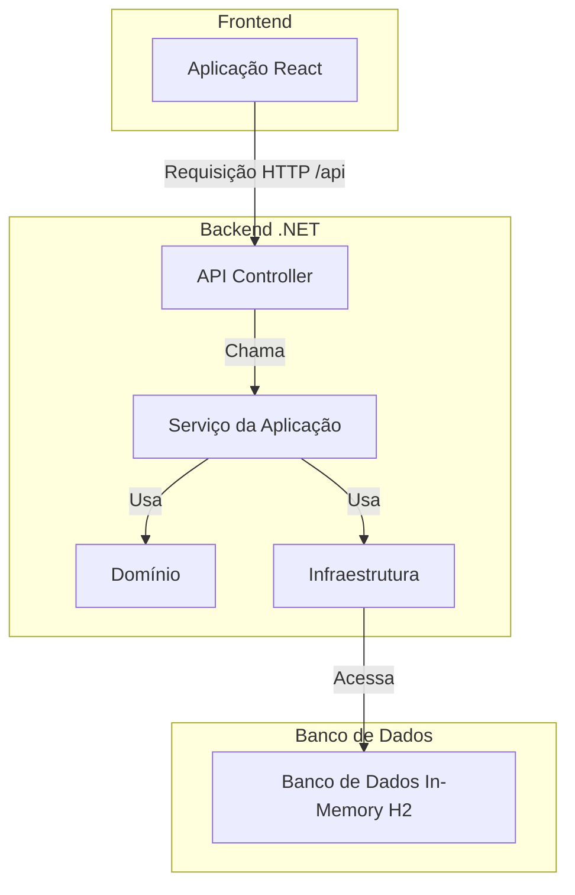

# Desafio Stefanini .NET React

<div style="display: flex; justify-content: center; align-items: center;" align="center">

[](https://qlty.sh/gh/jailtoncruz/projects/stefanini-dotnet-react)
[](https://qlty.sh/gh/jailtoncruz/projects/stefanini-dotnet-react)

</div>

Este projeto é uma aplicação web full-stack construída com .NET 9 para o backend e React para o frontend. Ele é estruturado como um monorepo usando pnpm workspaces e Turbo para gerenciar os processos de desenvolvimento e build.

## Arquitetura

O projeto segue o padrão de Clean Architecture para o backend .NET, separando as responsabilidades em camadas distintas. O frontend é uma single-page application (SPA) construída com React e Vite.

A solução está organizada nos seguintes projetos:

- `StefaniniDotNetReactChallenge.API`: O ponto de entrada principal do backend, uma ASP.NET Core Web API que expõe as funcionalidades da aplicação através de uma interface RESTful.
- `StefaniniDotNetReactChallenge.Application`: Contém a lógica da aplicação, serviços e data transfer objects (DTOs).
- `StefaniniDotNetReactChallenge.Domain`: Inclui as entidades de domínio, interfaces para repositórios e regras de negócio específicas do domínio.
- `StefaniniDotNetReactChallenge.Infrastructure`: Implementa a lógica de persistência de dados usando Entity Framework Core e fornece implementações concretas para as interfaces de repositório definidas na camada de Domínio.
- `StefaniniDotNetReactChallenge.Web`: A aplicação frontend em React.
- `StefaniniDotNetReactChallenge.Tests`: Projeto de testes

### Diagrama da Arquitetura



### Desenvolvimento vs. Produção

**Desenvolvimento:**

- O frontend React é servido pelo servidor de desenvolvimento do Vite em `http://localhost:5173`.
- O backend .NET é executado em `https://localhost:7009`.
- Para lidar com as requisições para a API, o servidor Vite atua como um proxy para qualquer requisição de `/api` para o backend.
- A aplicação .NET também encaminha requisições da root para o servidor vite `https://localhost:7009` -> `http://localhost:5173`, fazendo com que seja possivel acessar toda a aplicação por um único endereço.
- A API .NET é configurada com CORS para permitir requisições do servidor de desenvolvimento do Vite.

**Produção:**

- A aplicação React é compilada em arquivos estáticos (HTML, CSS, JS).
- Esses arquivos estáticos são colocados na pasta `wwwroot` do projeto `StefaniniDotNetReactChallenge.API`.
- A aplicação ASP.NET Core serve os arquivos estáticos da aplicação React e lida com as requisições da API na mesma porta.
- O `Dockerfile` empacota tudo em uma única imagem de contêiner para implantação. A aplicação é exposta na porta `8080`.

### DevOps

Aplicação está publicada no Oracle Cloud utilizando VPN e um serviço chamado EasyPanel, o dominio `stefanini-challenge.tomcruz.dev` está publicado no CloudFlare utilizando Proxy DNS como uma camada extra de segurança.

## Pré-requisitos

- [.NET 9.0 SDK](https://dotnet.microsoft.com/download/dotnet/9.0)
- [Node.js 22.14](https://nodejs.org/en/download/)
- [pnpm](https://pnpm.io/installation)
- [Docker](https://www.docker.com/get-started) (para executar em modo de produção)

## Instalação

1.  **Clone o repositório:**

    ```bash
    git clone https://github.com/jailtoncruz/stefanini-dotnet-react.git
    cd challenge-dotnet-react
    ```

2.  **Instale as dependências:**
    Este comando instalará as dependências do .NET e do Node.js.
    ```bash
    pnpm install
    ```

## Executando a Aplicação

### Desenvolvimento

Para iniciar o backend e o frontend em modo de desenvolvimento com hot-reloading, execute:

```bash
pnpm dev
```

- A API estará acessível em `https://localhost:7009`.
- A aplicação web estará disponível em `http://localhost:5173`.

### Produção (com Docker)

1.  **Compile a imagem Docker:**

    ```bash
    pnpm docker:build
    ```

2.  **Execute o contêiner Docker:**
    ```bash
    pnpm docker:run
    ```

A aplicação estará acessível em `http://localhost:8080`.

## Test Coverage

<div align="center">
  
</div>
